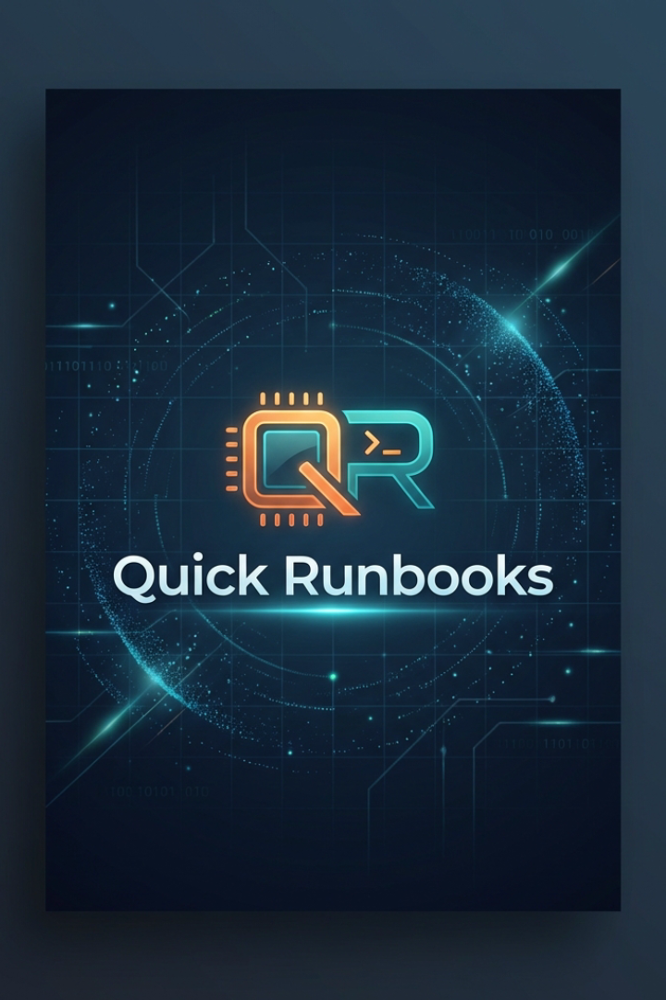
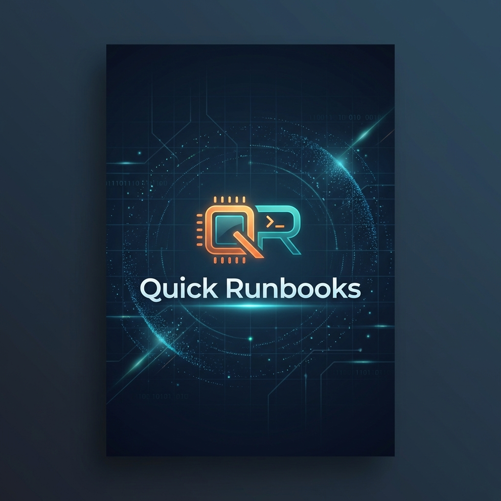
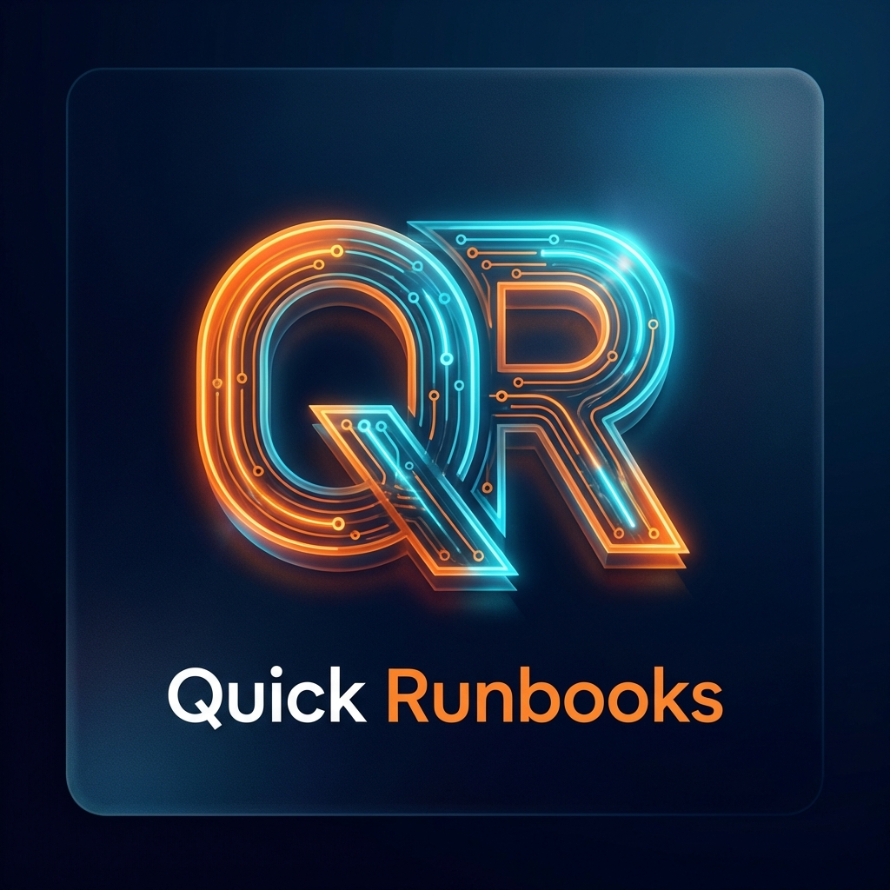
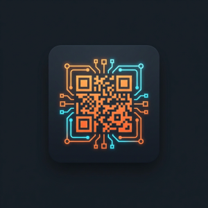
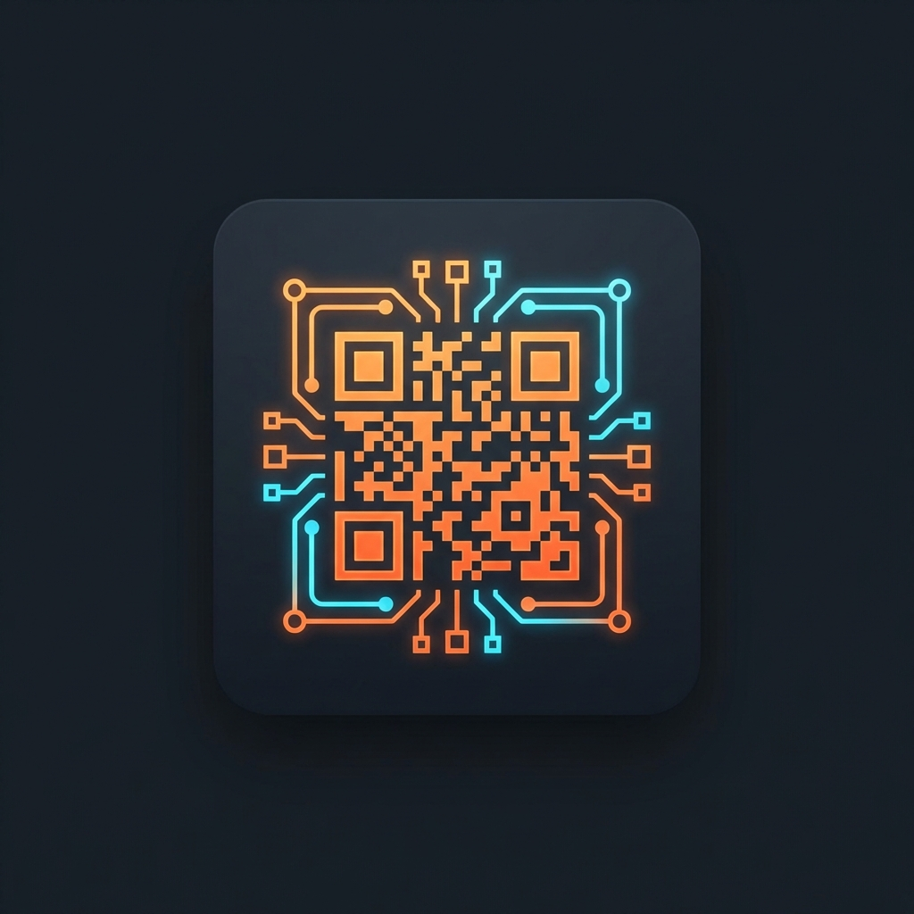

# IT Quick Runbooks - Store Visual Assets

I have generated the following premium branding assets for **IT Quick Runbooks**. These are ready for your Windows Store submission.

````carousel
### 1. Poster Art (2:3 / 9:16)
Highly recommended for Windows 10/11 and Xbox. Ideal for a striking first impression.

*   **Standard (720x1080)**: 
*   **High Res (1440x2160)**: 
*   **Original (Generated)**: 
<!-- slide -->
### 2. Box Art (1:1)
The core branding for various Store layouts. Focused on the "Abstract QR" logo.

*   **Standard (1080x1080)**: 
*   **High Res (2160x2160)**: 
*   **Original (Generated)**: 
<!-- slide -->
### 3. App Tile Icon (1:1)
Designed for high visibility at small sizes. The Store prioritizes this as your identity.

*   **Store Listing (300x300)**: 
*   **Medium Tile (150x150)**: 
*   **Small Tile (71x71)**: 
*   **Original (Generated)**: 
````

> [!TIP]
> All these images are organized in the `store_release_kit/images` folder. You can upload them directly from there to the Windows Dev Center.
