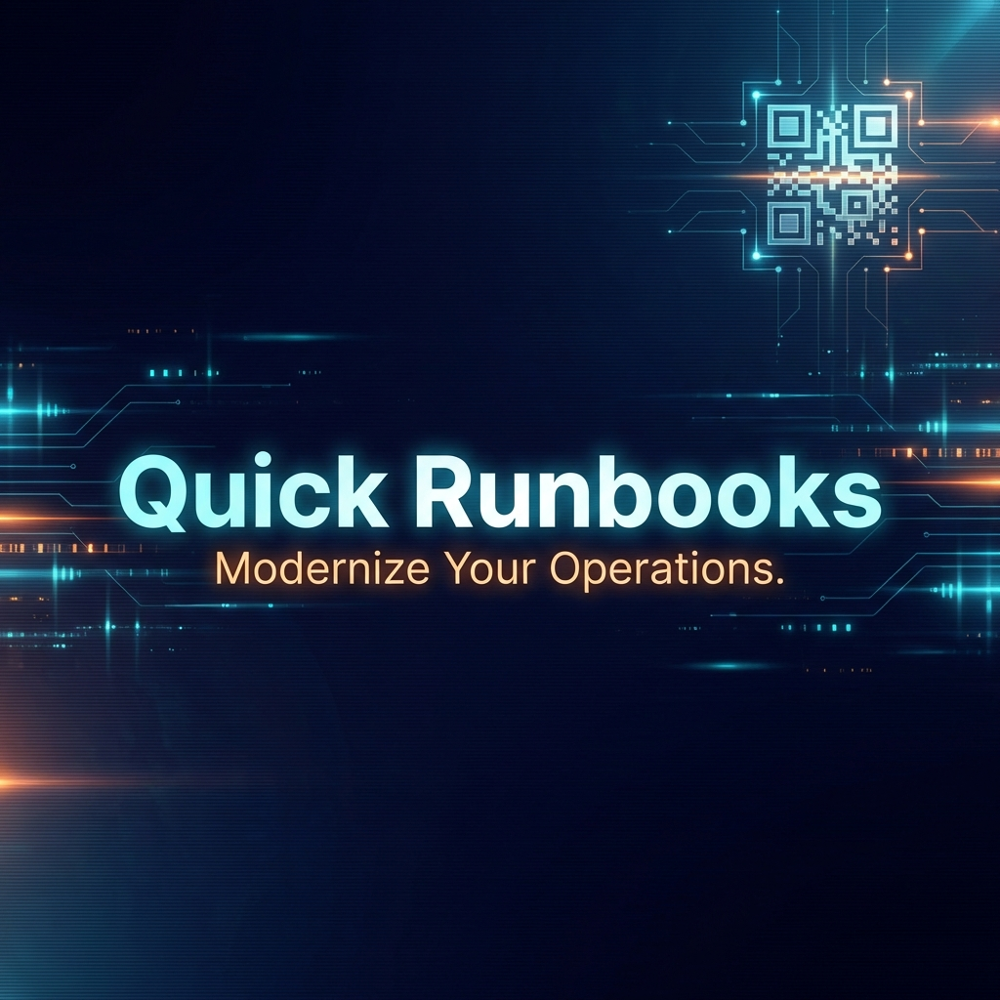
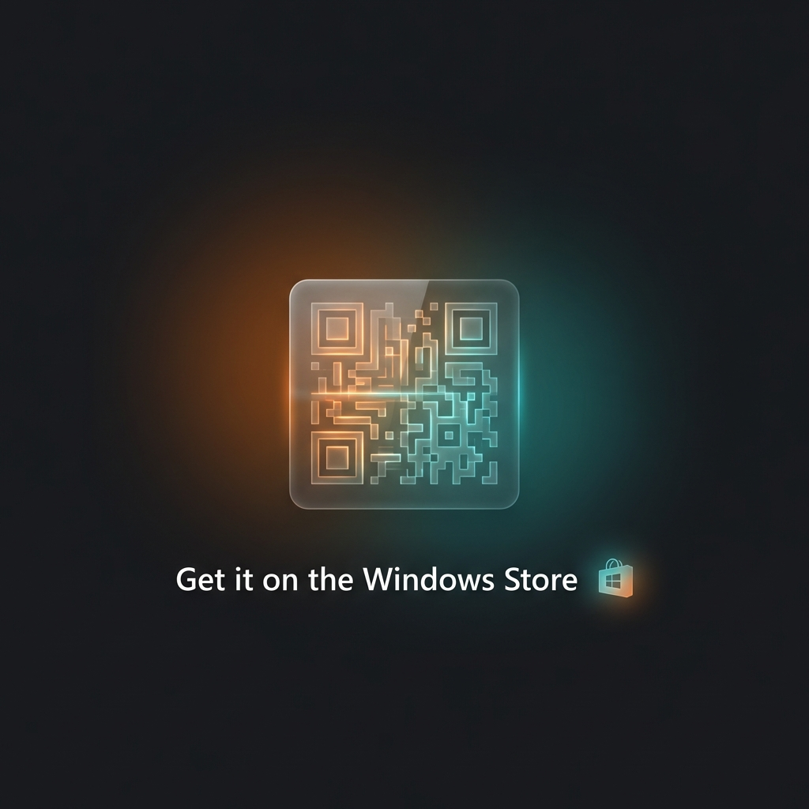

# IT Quick Runbooks - Video Trailer Storyboard

This is a structured plan for a **30-60 second** premium trailer for the Windows Store.

## Scene 1: The Intro (0-5s)

* **Visual**: 
* **Action**: Smooth fade in.
* **Audio**: Upbeat, tech-focused ambient track.
* **On-Screen Text**: "Modernize Your Operations."

## Scene 2: The Dashboard (5-15s)

* **Visual**: Screen recording of the main dashboard.
* **Action**: Scroll through the runbook list. Hover over some cards to show the subtle animations.
* **On-Screen Text**: "All your procedures. One central hub."

## Scene 3: Syntax Highlighting & Word Wrap (15-25s)

* **Visual**: Close-up of a code block.
* **Action**: Resize the window to show **Smart Word Wrap** in action. Use the "Copy" button.
* **On-Screen Text**: "Pro Syntax Highlighting. No manual scrolling."

## Scene 4: The Smart Editor (25-35s)

* **Visual**: Runbook Editor view.
* **Action**: Open the language dropdown, select a language, and type a simple command.
* **On-Screen Text**: "Edit on the fly. Built for teams."

## Scene 5: Contextual Tags (35-45s)

* **Visual**: Tag cloud.
* **Action**: Click between "IAAS" and "PAAS" to show the tags updating dynamically.
* **On-Screen Text**: "Focus on what matters. Smart Tagging."

## Scene 6: Outro (45-60s)

* **Visual**: 
* **Action**: Fade out with the logo.
* **On-Screen Text**: "Available now on the Windows Store."

---

> [!TIP]
> **Recording Tip**: Use a tool like OBS or Snipping Tool (Win + Alt + R) to record your screen at **1080p** for the best quality. The intro and outro images are in the `store_release_kit/images` folder.
